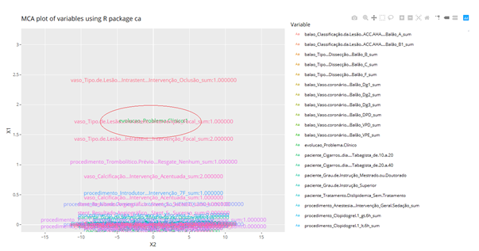

# Estrutura de Arquivos e Pastas
~~~
├── README.md          <- apresentação do projeto
│
├── data               <- base de dados restrito
│   └── NDA            <- Documento de confidencialidade dos dados
│
├── notebooks          <- Jupyter notebooks
│
├── src                <- R e python
└── media              <- mídias usadas no projeto
~~~

## `data`
A base de dados foi fornecida pelo médico Luiz Sérgio de Carvalho da Faculdade de Ciências Médicas da Unicamp, contendo dados de pacientes que passaram por procedimento de cateterismo. A base é composta por pacientes distribuídos em 7 estados no Brasil e inclui os seguintes conjuntos de dados: dados sobre o paciente, sobre o procedimento, balões utilizados , stents, vasos tratados, complicações durante o cateterismo e a evolução pós operatória. Dentre estes conjuntos de dados são disponibilizados informações como idade, peso, existência de hipertensão arterial, diabetes, entre outros, bem como dados do procedimento cirúrgico como: duração, convênio, quantidade de vasos tratados e medicamentos administrados.

A base pertence à clínica que coletou os dados e portanto não é pública. Apenas os dados agregados e resultados serão exibidos.

## `notebooks`

Reestruturação da base de dados: [.ipynb](notebooks/Data%20Preparation.ipynb)

Análise exploratória distribuições e frequências: [.ipynb](media/Análise%20Exploratória.ipynb)

Modelagem: [.ipynb](notebooks/Modelagem.ipynb)

AutoMlL: [.ipynb](media/AutoML-H20.ipynb)

## `src`
Árvore de decisão: [.str](src/Decision-Tree-CHAID.str)

Análise de correspondência: >>>Código em R da Danielle<<<

## `assets`

Árvore de decisão gerada:[.png](media/Decision_tree.png)

Levantamento do significado de alguns termos médicos encontrados na base de dados: [.xlsx](media/Definições.xlsx)

Questionário de entendimento do negócio*: [.doc](media/Questionário%20-%20Entendimento%20do%20Negócio.docx) 

Questionário de entendimento dos dados*: [.doc](media/ENTENDIMENTO%20DOS%20DADOS.docx)

*Note: Estes documentos são apenas modelos devido a confidencialiade dos dados

# Modelo para Apresentação do Projeto

# Projeto `Determinação de informações relevantes para classificação de fracasso clínico após cateterismo`
# Project `Determination of relevant features for classification of success and failure of percutaneous coronary intervention`

# Descrição Resumida do Projeto
O projeto tem como intuito identificar quais informações são mais relevantes para determinar um fracasso clínico após uma intervenção coronária percutânea (cateterismo), além de realizar a própria predição de sucesso ou fracasso. No pré-operatório e durante o próprio procedimento são coletadas uma série de informações, desde dados cadastrais dos pacientes até os medicamentos utilizados no processo ou mesmo complicações durante a cirurgia. Com base nessas informações coletadas até o final do procedimento este projeto se dedica a realizar análises que fornecerão não apenas a predição, mas sobretudo insights que guiem médicos em seu ofício.

# Abstract in English
The project aims to identify which information is most relevant to determine a clinical failure after percutaneous coronary intervention, in addition to making its own prediction of success or failure. In the preoperative period and during the procedure itself, some information is collected, from the patient's registration data to the medications used in the process or complications during the surgery. Based on this information collected until the end of the procedure, this project is dedicated to conducting analyzes that will provide not only forecasts, but, above all, insights that guide doctors in their day by day.

# Equipe
* `Danielle Lanzarini Pinto` - `116559`
* `Jampierre Vieira Rocha` - `231372`
* `Tito Barbosa Rezende` - `025327`

# Vídeo do Projeto
[Vídeo](media/VideoFinalHD.mp4)

# Introdução e Motivação
Todos os dias são coletados dados de pacientes em clínicas e hospitais para fins legais e administrativos. No entanto, a cultura de dados não é enraizada na maioria destes locais, tornando estes dados quase sempre inutilizados para os fins médicos. Utilizando-se da ciência de dados é possível extrair conhecimento de dados e permitir que médicos e pacientes sejam beneficiados.

A motivação deste trabalho é justamente utilizar esta oportunidade da disciplina para apresentar esta possibilidade de análise em uma situação real. 

Desta forma deu-se início ao trabalho em conjunto ao doutor Luiz Sérgio de Carvalho da Faculdade de Ciências Médicas da Unicamp. Foram disponibilizados dados reais de pacientes  submetidos ao cateterismo, de forma que o objetivo deste projeto é identificar quais destas informações são mais relevantes para determinar um fracasso clínico após uma intervenção coronária percutânea.

A solução adotada envolve análises exploratórias e modelagem, com algoritmos parametrizáveis e algoritmos “black box”.

Como resultado deste projeto têm-se quatro legados: as análises exploratórias e seus respectivos insights, os modelos, determinação de flags de atenção para médicos durante o pré e período operatório e a criação de dois questionários guias para as etapas de entendimento do contexto e entendimento dos dados. Ambas as etapas devem ser realizadas com o máximo de rigor, uma vez vez que o contexto médico é regido por muitas particularidades. 

## Perguntas de Pesquisa
Quais informações referentes aos pacientes e seus respectivos procedimentos cirúrgicos de cateterismo são mais relevantes para a classificação de sucesso ou fracasso pós-operatório?

## Objetivos do projeto
O projeto tem como objetivo abordar o problema apresentado utilizando-se da Metodologia CRISP-DM e adotando técnicas estatísticas e de machine Learning.  Para a análise exploratória estatística tem-se:
* Estatísticas Descritivas
* Testes de Hipótese
* Tabelas de contingências e Análise de Correspondência

No que abrangem técnicas de modelagem estatística e  machine learning, tem-se:
* Árvore de decisão
* Regressão Logística
* Random Forest
* Rede Neural
* GBOOST
* SVM
* AUTOML

Os modelo final será avaliado quanto às métricas de acurácia e f1-score.

# Recursos e Métodos
## Bases de Dados
Base de Dados | Detentor dos direitos de conteúdo da base | Resumo descritivo e uso
----- | ----- | -----
Paciente | Médico Doutor Luiz Sérgio de Carvalho - FCM UNICAMP | `Base de informações cadastrais do paciente, como por exemplo: data de nascimento, idade, imc, pressão arterial normal e etc.`
Procedimento | Médico Doutor Luiz Sérgio de Carvalho - FCM UNICAMP | `Base de informações do procedimento cirúrgico realizado, como: duração da intervenção, via de acesso, anestesia dentre outros.`
Complicação | Médico Doutor Luiz Sérgio de Carvalho - FCM UNICAMP | `Base de informações com complicações observadas durante procedimento cirúrgico realizado, como por exemplo:tipo de complicação, grau da complicação, conduta adotada etc.`
Balão | Médico Doutor Luiz Sérgio de Carvalho - FCM UNICAMP | `Base de informações com dados a respeito dos balões utilizados pelos paciente. Balão é um dispositivo de assistência circulatória mecânica, utilizado no cateterismo para dilatar as artérias e desobstruí-las, ou, criar condições para implantação de um stent.`
Stent | Médico Doutor Luiz Sérgio de Carvalho - FCM UNICAMP | `Base de informações a respeito do Stent instalado no paciente. Stent é um dispositivo médico utilizado para manter a dilatação de artérias, garantindo o fluxo sanguíneo e evitando infarto.`
Vaso | Médico Doutor Luiz Sérgio de Carvalho - FCM UNICAMP | `Base de informações do vaso tratado durante o procedimento de cateterismo.`
Evolução | Médico Doutor Luiz Sérgio de Carvalho - FCM UNICAMP | `Base de informações com os desfechos das intervenções,como complicações, sucesso clínico, óbito entre outras.`

## Ferramentas
Ferramenta | Endereço na Web | Resumo descritivo e uso
----- | ----- | -----
Jupyter Notebook | https://jupyter.org/ | `Documento virtual que permite execução de rotinas usuais de programação e documentação de todo o processo de produção do código. No projeto foi utilizado para o código de reestruturação da base de dados e para os modelos.`
Google Colab | https://colab.research.google.com/ | `Similar ao jupyter notebook, o Colab é uma lista de células que podem conter textos explicativos ou códigos executáveis e suas respectivas saídas. Para o projeto foi utilizado para as análise descritivas e modelo de AutoML da H2O.`
R Studio | https://rstudio.com/ | `Software livre de ambiente de desenvolvimento integrado para R, uma linguagem de programação para gráficos e cálculos estatísticos. Neste projeto, utilizado para a análise de correspondência.`
SPSS Modeler 18.1 | https://www.ibm.com/br-pt/products/spss-modeler | `Ambiente de trabalho de mineração de dados versátil que ajuda a criar modelos preditivos precisos de maneira rápida e intuitiva, sem programação. No projeto foi Utilizado para criação do modelo de árvore de decisão por possuir uma interface mais interativa para a construção dos ramos.`

# Metodologia e evolução do projeto
O projeto adotou a metodologia CRISP-DM, as etapas proposta na metodologia são descritas a seguir:
1. Entendimento do Negócio
2. Entendimento dos Dados
3. Preparação dos Dados
4. Modelagem
5. Avaliação
6. Implantação

As setas apresentadas na figura indicam os caminhos mais comuns, contudo em teoria a qualquer momento do ciclo é possível voltar para quaisquer uma das etapas anteriores. Foi o que ocorreu neste projeto.

# Detalhamento do Projeto e evolução
1º Inicialmente o trabalho foi iniciado observando os conjuntos de dados disponíveis. Antes que fosse realizado um entendimento mais profundo dos dados propriamente dito, foi realizada uma busca por alguns termos médicos técnicos presente nas variáveis disponíveis ([ver aqui levantamento](media/Definições.xlsx)). Além disso foram elencadas uma série de perguntas que deveriam ser questionadas para o médico responsável. Foi realizada uma interação com o  médico para entendimento do cenário e contexto, bem como, termos técnicos.

Desta conversa foi derivado um questionário que fica como legado do projeto, com objetivo de facilitar o leitor na estruturação de informações em etapa de contextualização do problema ([ver aqui](media/Questionário%20-%20Entendimento%20do%20Negócio.docx)). As respostas do questionário para o problema aqui abordado são confidenciais e resguardadas eplo NDA assinado entre médico e integrantes do grupo.

No que abrange a metodologia CRISP Desta forma, primeiro foi iniciado um entendimento dos dados, o qual guiou o posterior entendimento do negócio.

2º Após a contextualização do cenário iniciou-se o entendimento dos dados. Sem grandes manipulações uma série de dúvidas apareceram como por exemplo: como é possível identificar unicamente um procedimento? Repetições de conteúdo quando se deveria ter uma chave única é uma erro no dado? O que é variável resposta e o que é variável explicativa? Como agrupar o dado de forma que cada intervenção cirúrgica esteja com todas informações em uma única linha? Qual a chave de cruzamento entre as diferentes variáveis? Existe algum significado nos valores nulos? Novamente, foi necessário voltar ao médico e realizar alguns questionamentos, bem como iniciar algumas análises iniciais.

Desta forma observamos que durante o entendimento dos dados foi necessário dar um passo atrás e entender mais algumas circunstâncias não compreendidas na etapa anterior.

Também foi estruturado um formulário básico que deve ser capaz de orientar o leitor na estruturação de informações em  etapas de entendimento dos dados.([ver aqui](media/ENTENDIMENTO%20DOS%20DADOS.docx))

3º Após os questionamentos, chegou-se a conclusão que a base de dados deveria ser reestruturada de forma que cada combinação de id de paciente + id de intervenção tivesse todas informações contidas em apenas uma única coluna. De forma geral, as variáveis contínuas foram agrupadas em função de algumas estatísticas de sumarização como: média, máx, min, contagem, usando sempre como chave de agregação o id de paciente + id de intervenção. E as variáveis categóricas foram realizadas o one hot encoder, isto é, cada categoria de uma dada variável tornou-se uma nova coluna na base de dados, preenchida com “0” (ausencia) ou “1” (presença) e no posteriormente foram somadas utilizado a chave composta de id de paciente + id de intervenção.

O principal ponto de atenção nesta etapa é a definição de quais operações que serão utilizadas em cada agrupamento. Foi necessário olhar variável por variável, verificar seu domínio, variabilidade, valores nulos além de  validar se em contextos de negócio fazia sentido o proposto, sobretudo no que diz respeito às operações de variáveis numéricas. Por exemplo: não fazia sentido calcular a média de uma pressão arterial, dado que a diferença entre a pressão baixa e alta é uma informação relevante, sendo portanto necessário realizar uma manipulação sob esse delta de interesse e avaliando individualmente seu mínimo/máximo.

Assim, observamos que nesta etapa é realizada a preparação dos dados, mas também novamente volta-se na etapa de entendimento do negócio para validação da reestruturação proposta.

A descrição de todas as operações realizadas para reestruturação podem ser conferidas [aqui](media/Operações%20realizadas%20em%20casa%20base.xlsx) e o notebook gerador dos agrupamentos [aqui](notebooks/Data%20Preparation.ipynb).

4º- Após a reestruturação e agrupamento da base iniciou-se a etapa de análise exploratórias. O primeiro tipo de análise realizada foi a comparação das distribuições de cada uma das features, com relação a variáveis resposta.

Este processo foi simples no que diz respeito ao código gerado, contudo sua análise minuciosa é muito extensa, dado que após a reestruturação tem-se  cerca de 700 variáveis para avaliar, assim, no relatório de análise exploratório é ressaltado apenas os casos de mais destaque.

Esta análise pode ser conferida [aqui](media/Análise%20Exploratória.ipynb).

Os resultados obtidos aqui serviram para guiar uma segunda etapa de análise exploratória, mas não mudou grandemente a forma como foi realizada a etapa de modelagem que viria a seguir.

Podemos caracterizar esta etapa como a de Entendimento dos dados no CRISP-DM.

5º Em seguida partiu-se para o treinamento dos primeiros modelos de classificação para sucesso ou fracasso clínico. A base de dados foi divida entre bases de treino e teste e os primeiros resultados da modelagem surgiram.

Os notebooks com experimentos encontram-se >>>aqui<<< (modelos com experimentos nosso ) e [aqui](media/AutoML-H20.ipynb) (testando o AutoML da H2o).

Sendo assim ,este passo consistiu no primeiro momento em que entrou-se na etapa de modelagem pelas classificação do CRISP-DM.

6º Com base nos insights retirados na etapa de análise exploratória e nas variáveis com maior importância para os modelos treinados na etapa de modelagem, realizou-se uma segunda rodada de análises exploratórias, focando agora nas variáveis de maior interesse. Foram empregada técnicas de sumarização gráfica como boxplots e análise de correspondência. O objetivo disto é conseguir chegar a uma conclusão mais palpável das variáveis que ajudam a discriminar a resposta.

Estas análises podem ser verificadas [aqui](src/codigo-analise-correspondencia.R).

Desta forma, mais uma vez retornamos a parte de entendimento dos dados no CRISP-DM, o que nos ajuda a confirmar o já dito anteriormente, do quanto é comum ir e voltar nas etapas ao longo do processo.

7º Finalizando o projeto foram selecionados os modelos que obtiveram a melhor performance, um modelo “black box” que não nos fornece informações claros sobre as relações entre as features e variável resposta e um modelo interpretável que permite facilmente esta compreensão.

O modelo final black box implementado pode ser encontrado [aqui](notebooks/Modelagem.ipynb).

O modelo final black box AUTOML pode ser encontrado [aqui](media/AutoML-H20.ipynb).

O modelo final interpretável pode ser encontrado [aqui](src/Decision-Tree-CHAID.str) (arquivo do SPSS).

Finaliza-se então na etapa de avaliação do CRISP-DM.

8º Por fim, elencou-se as relações observadas como forma de guiar os médicos a levantar “flags de atenção” de acordo com a ocorrência dos cenários apresentados.

Além disso, também pode ser disponibilizado os modelos criados para implantação em produção. Ainda que se espere que este modelo seja evoluído ao longo do tempo, já é possível trazer ganhos se utilizado até que se tenha uma versão mais robusta.

Finaliza-se a metodologia adotada terminando na etapa de implantação do CRISP-DM com a apresentação dos resultados obtidos para o médico. Nesta conversa é possível levantar oportunidade de melhora que serão discutidas no item “Trabalhos futuros”. Desta forma poderíamos concluir que um novo ciclo do CRISP-DM seria iniciado para essa evolução.

# Resultados e Discussão
Para a predição de fracasso clínico foi utilizada uma combinação entre técnicas de análise exploratória e modelagem.

## Análise de Correspondência
Na etapa exploração dos dados, a técnica de análise de correspondência forneceu insights interessantes a respeito da relação entre o fracasso clínico e features categóricas, algo interessante já que a correlação não é uma métrica apropriada para este tipo de dados.

Os resultados desta análise, juntamente com a importância das features do modelos construídos ajudaram posteriormente a criação de uma mapa de pontos de atenção que será apresentado mais adiante nesta sessão.

Detalhando a etapa de modelagem , pode-se destacar os seguintes experimentos: 
* Modelo XGBOOST: modelo com implementação completa realizado pelo grupo e com treinamento utilizando a técnica de random oversampling (validação com base nos moldes originais).
* ModeloXGBOOST AutoML H20: modelo com implementação utilizando suporte de automl da H20.
* Modelo de Árvore de Decisão: modelo com implementação completa realizada pelo grupo e com treinamento utilizando a técnica de undersampling (validação com base nos moldes originais).

Algumas métricas de qualidade, matriz de confusão e variáveis mais importantes de cada modelo podem ser conferidas a seguir:

## Modelo XGBOOST - implementação própria

## Modelo XGBOOST Auto ML - H20

## Modelo Árvore de Decisão

## Comparação  Geral 

|                   | SUCESSO CLÍNICO | FRACASSO CLÍNICO |
|-------------------|-----------------|------------------|
| XGBOOST           | 0.96            | 0.41             |
| AUTOML H2O        | 0.96            | 0.44             |
| ÁRVORE DE DECISÃO | 0.96            | 0.49             |

Com base nos resultados das análises exploratórias e dos modelos, entendemos que mais do que uma predição é essencial que se possa fornecer aos médicos informações que devem ser tratadas como pontos de atenção no processo pré-operatório e operatório. Desta forma, como um dos grandes resultados deste trabalho foi realizada uma estruturação ocorrências ou características que uma vez identificadas estariam ligadas a um aumento da probabilidade de aquele caso ter uma evolução qualificada como fracasso clínico. Esta estruturação pode ser conferida na tabela a seguir. Cada informação da base deve ser interpretada individualmente como um incremento na probabilidade de fracasso, contudo sem um valor determinado para este incremento.

# Conclusões
Com a execução deste projeto conclui-se prontamente que uma das grandes dificuldades encontradas (e possivelmente extensível para outros problemas na área da saúde) diz respeito a fase de entendimento do contexto e a posterior utilização deste conhecimento transcritos em uma preparação de dados e engenharia de features adequadas.

Podemos entender que este projeto foi a execução de um ciclo completo da metodologia CRISP-DM, e portanto, se tratando de um ciclo, em outras interações certamente serão captadas informações não percebidas nessa rodada. Outro ponto de atenção neste processo é a existência de inúmeras features com dados faltantes, muito comum em dados médicos. Esta característica limitou muito o desempenho de diversos modelos que não mostram lidar de forma apropriada com dados faltante. Desta forma, um grande aprendizado do processo é a necessidade de lidar com dados faltantes não apenas com técnicas estatísticas e de machine learning, mas sobretudo validando o entendimento do que cada dado faltante na base pode significar. A título de exemplo podemos citar casos em que informações são anotadas manualmente após o procedimento cirúrgico, mas em situações de emergência ou complicações no ato operatório a equipe responsável por essa anotação simplesmente não realiza a coleta de dados, isto é, este caso a existência de um dado faltante pode ser uma informação relevante para caracterização do sucesso ou fracasso clínico.

De forma geral, foi possível perceber que independente da técnica adotada para extração de insights sobre quais as variáveis mais relevante para caracterização do problema, todas elas pareceram convergir, tornando possível a construção de uma mapa de pontos de atenção que podem ser mentalizados pela equipe médica, mesmo sem nenhum modelo de machine learning em produção. Por fim, no que abrange as técnicas de modelagem, é notado também que os modelos obtiveram métricas muito próximas, dando indícios que para este problema modelos paramétricos mais simples sejam suficientes e podem fornecer uma explicabilidade maior que a área da saúde exige.

# Trabalhos Futuros
ENTENDIMENTO DO NEGÓCIO E DADOS
* Validação  feature por feature com especialista para compreensão dos valores nulos e validar se não existe alguma variável de pós-cirurgico sendo incluída como feature (variável futura).
* Verificar quais features tem conteúdo subjetivo e fazer o teste de tirá-las do modelo.

PREPARAÇÃO DOS DADOS
* Estratégias para lidar com dados faltantes.
* Seleção de features
* Encoders binário >  transformar em um único
* Após one hot enconding agregar pelo máximo e não pela soma, dado que todos os modelos consideraram a existência ou não de algo e não quantas vezes ocorreu.
* Recategorizar variáveis de medicamentos agrupando por princípio ativo ou objetivo, reduzindo a quantidade de features.

MODELAGEM
* Criar modelos individuais por tipo de fracasso e posteriormente fazer o ensemble 

