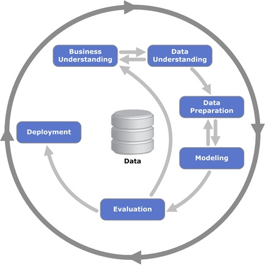

# Estrutura de Arquivos e Pastas
~~~
├── README.md          <- apresentação do projeto
│
├── data               <- base de dados restrito
│   └── NDA            <- Documento de confidencialidade dos dados
│
├── notebooks          <- Jupyter notebooks
│
├── src                <- R e python
└── media              <- mídias usadas no projeto
~~~

## `data`

## `notebooks`

Reestruturação da base de dados: [.ipynb](notebooks/2_Data%20Preparation.ipynb)

Análise exploratória distribuições e frequências: [colab](https://colab.research.google.com/drive/1L43e0xV_y1hXsxCw8xhJ_E4FFb_FrIzd?usp=sharing) <<< precisa de permissão

Modelagem: [.ipynb](notebooks/All_Features_ALL_Y_INDIVIDUALLY-MergeV2.ipynb)

AutoMlL:

## `src`
Árvore de decisão: [.str](src/Decision-Tree-CHAID.str)

Análise de correspondência:

## `assets`

Árvore de decisão gerada:[.png](media/Decision_tree.png)

Levantamento do significado de alguns termos médicos encontrados na base de dados: [.xlsx](media/Definições.xlsx)

Questionário de entendimento do negócio: [.doc](media/Questionário%20-%20Entendimento%20do%20Negócio.docx)

Questionário de entendimento dos dados: [.doc](media/ENTENDIMENTO%20DOS%20DADOS.docx)

# Modelo para Apresentação do Projeto

# Projeto `Determinação de informações relevantes para classificação de fracasso clínico após cirurgias cardíacas`
# Project `Determination of information relevant to the classification of clinical failure after cardiac surgery`

# Descrição Resumida do Projeto
O projeto tem como intuito identificar quais informações são mais relevantes para determinar um fracasso clínico após uma cirurgia cardíaca, além de realizar a própria predição de sucesso ou fracasso. No pré-operatório e durante o próprio procedimento são coletadas uma série de informações, desde dados cadastrais dos pacientes até os medicamentos utilizados no processo ou complicações durante a cirurgia. Com base nessas informações coletadas até o final do procedimento,este projeto se dedica a realizar análises que fornecerão não apenas a predição, mas sobretudo insights que guiem médicos em seu ofício.

# Abstract in English
The project aims to identify which information is most relevant to determine a clinical failure after cardiac surgery, in addition to making its own prediction of success or failure. In the preoperative period and during the procedure itself, some information is collected, from the patient's registration data to the medications used in the process or complications during the surgery. Based on this information collected until the end of the procedure, this project is dedicated to conducting analyzes that will provide not only forecasts, but, above all, insights that guide doctors in their day by day.

# Equipe
* `Danielle Lanzarini Pinto` - `116559`
* `Jampierre Vieira Rocha` - `231372`
* `Tito Barbosa Rezende` - `025327`

# Vídeo do Projeto
[Vídeo](media/VideoFinalHD.mp4)

# Introdução e Motivação
~~~
<Descrição do tema do projeto, incluindo motivação, contexto gerador e caracterização do problema. A introdução também pode apresentar iniciativas correlatas para lidar com o problema (não obrigatório) e deve introduzir de forma mais detalhada que o resumo a solução proposta e resultados alcançados. Aqui também são apresentadas as seções do projeto.>
~~~

## Perguntas de Pesquisa
Quais informações referentes aos pacientes e seus respectivos procedimentos cirúrgicos cardíacos são mais relevantes para a classificação de sucesso ou fracasso pós-operatório?

## Objetivos do projeto
~~~
<Como seu projeto propôs abordar o problema apresentado.>
~~~

# Recursos e Métodos
## Bases de Dados
Base de Dados | Detentor dos direitos de conteúdo da base | Resumo descritivo e uso
----- | ----- | -----
Paciente | Médico Doutor Luiz Sérgio de Carvalho - FCM UNICAMP | `Base de informações cadastrais do paciente, como por exemplo: data de nascimento, idade, imc, pressão arterial normal e etc.`
Procedimento | Médico Doutor Luiz Sérgio de Carvalho - FCM UNICAMP | `Base de informações do procedimento cirúrgico realizado, como: duração da intervenção, via de acesso, anestesia dentre outros.`
Complicação | Médico Doutor Luiz Sérgio de Carvalho - FCM UNICAMP | `Base de informações com complicações observadas durante procedimento cirúrgico realizado, como por exemplo:tipo de complicação, grau da complicação, conduta adotada etc.`
Balão | Médico Doutor Luiz Sérgio de Carvalho - FCM UNICAMP | `Base de informações com complicações observadas a respeito dos balões utilizados pelos paciente. Balão e um dispositivo de assistência circulatória mecânica, que`
Stent | Médico Doutor Luiz Sérgio de Carvalho - FCM UNICAMP | `<>`
Vaso | Médico Doutor Luiz Sérgio de Carvalho - FCM UNICAMP | `<>`
Evolução | Médico Doutor Luiz Sérgio de Carvalho - FCM UNICAMP | `<>`

## Ferramentas
Ferramenta | Endereço na Web | Resumo descritivo e uso
----- | ----- | -----
Jupyter Notebook | https://jupyter.org/ | `Documento virtual que permite execução de rotinas usuais de programação e documentação de todo o processo de produção do código. No projeto foi utilizado para o código de reestruturação da base de dados e para os modelos.`
Google Colab | https://colab.research.google.com/ | `Similar ao jupyter notebook, o Colab é uma lista de células que podem conter textos explicativos ou códigos executáveis e suas respectivas saídas. Para o projeto foi utilizado para as análise descritivas e modelo de AutoML da H2O.`
R Studio | https://rstudio.com/ | `Software livre de ambiente de desenvolvimento integrado para R, uma linguagem de programação para gráficos e cálculos estatísticos. Neste projeto, utilizado para a análise de correspondência.`
SPSS Modeler 18.1 | https://rstudio.com/ | `Ambiente de trabalho de mineração de dados versátil que ajuda a criar modelos preditivos precisos de maneira rápida e intuitiva, sem programação. No projeto foi Utilizado para criação do modelo de árvore de decisão por possuir uma interface mais interativa para a construção dos ramos.`

# Metodologia e evolução do projeto
O projeto adotou a metodologia CRISP-DM, as etapas proposta na metodologia são descritas a seguir:
1. Entendimento do Negócio
2. Entendimento dos Dados
3. Preparação dos Dados
4. Modelagem
5. Avaliação
6. Implantação

As setas apresentadas na figura indicam os caminhos mais comuns, contudo em teoria a qualquer momento do ciclo é possível voltar para quaisquer uma das etapas anteriores. Foi o que ocorreu neste projeto.

1º Inicialmente o trabalho foi iniciado observando os conjuntos de dados disponíveis. Antes que fosse realizado um entendimento mais profundo dos dados propriamente dito, foi realizada uma busca por alguns termos médicos técnicos presente nas variáveis disponíveis ([ver aqui levantamento](https://www.google.com/url?q=https://docs.google.com/spreadsheets/d/1y4ACXRvBOYz6ujMD07nFcxU1CidBij2Lj65VGddk-DI/edit?usp%3Dsharing&sa=D&ust=1593606923979000&usg=AFQjCNFBdQCoFk-gS32QQFE1f58ueod71g)). Além disso foram elencadas uma série de perguntas que deveriam ser questionadas para o médico responsável. Foi realizada uma interação com o  médico para entendimento do cenário e contexto bem como termos técnicos.

Desta conversa foi derivado um questionário que ficaria de legado do projeto, com objetivo de facilitar a estruturação de informações nesta etapa de contextualização do problema ([ver aqui](https://www.google.com/url?q=https://docs.google.com/document/d/1BA2KeM2eLvlUOB0x747jSjdEJ8U5M_jymGap54umR-s/edit?usp%3Dsharing&sa=D&ust=1593606923989000&usg=AFQjCNHIXdTgDNTfb5C9eBfcaV1r6bLB0g)).

Desta forma, primeiro foi iniciado um entendimento dos dados para guiar o posterior entendimento do negócio.

2º Após a contextualização do cenário iniciou-se o entendimento dos dados. Sem grandes manipulações uma série de dúvidas apareceram como por exemplo: como é possível identificar unicamente um procedimento? Repetições de conteúdo quando se deveria ter uma chave única é uma erro no dado? O que é variável resposta e o que é variável explicativa? Como agrupar o dado de forma que cada intervenção cirúrgica esteja com todas informações em uma única linha? Qual a chave de cruzamento entre as diferentes variáveis? Existe algum significado nos valores nulos? Novamente, foi necessário voltar ao médico e realizar alguns questionamentos, bem como iniciar algumas análises iniciais.

Desta forma observamos que durante o entendimento dos dados foi necessário dar um passo atrás e entender mais algumas circunstâncias não compreendidas na etapa anterior.

Também foi estruturado um formulário básico que deve ser capaz de orientar informações, com objetivo de facilitar a estruturação de informações nesta etapa de entendimento dos dados.([ver aqui](https://www.google.com/url?q=https://docs.google.com/document/d/1BA2KeM2eLvlUOB0x747jSjdEJ8U5M_jymGap54umR-s/edit?usp%3Dsharing&sa=D&ust=1593606923989000&usg=AFQjCNHIXdTgDNTfb5C9eBfcaV1r6bLB0g))

3º Após os questionamentos, chegou-se a conclusão que a base de dados deveria ser reestruturada de forma que cada combinação de id de paciente + id de intervenção tivesse todas informações contidas em apenas uma única coluna. De forma geral, as variáveis contínuas foram agrupadas em função de algumas estatísticas de sumarização como: média, máx, min, contagem, usando sempre como chave de agregação o id de paciente + id de intervenção. E as variáveis categóricas foram realizo o one hot encoder, isto é, cada categoria de uma dada variável tornou-se uma nova coluna na base de dados, preenchida com “0” (ausencia) ou “1” (presença) e no finalmente foram somadas utilizado a chave composta de id de paciente + id de intervenção.

O principal ponto de atenção nesta etapa é a definição de quais operações que serão utilizadas em cada agrupamento. Foi necessário olhar variável por variável, verificar seu domínio, variabilidade, valores nulos além de  validar se em contextos de negócio fazia sentido o proposto, sobretudo no que diz respeito às operações de variáveis numéricas. Por exemplo: não fazia num sentido calcular a média de uma pressão arterial, dado que a diferença entre a pressão baixa e alta é uma informação relevante, tendo portanto que fazer uma manipulação sob esse delta ou avaliando individualmente seu mínimo/máximo.

Assim, observamos que nesta etapa é realizada a preparação dos dados, mas também novamente volta-se na etapa de entendimento do negócio para validação da reestruturação proposta.

A descrição de todas as operações realizadas para reestruturação podem ser conferidas [aqui](https://www.google.com/url?q=https://docs.google.com/spreadsheets/d/1QbJ6BlBSz8fg0MsXi-8l8mPrXbIqCAK9WZdgsu-IN4E/edit?usp%3Dsharing&sa=D&ust=1593606923990000&usg=AFQjCNH-6QeGStSzhoWE-l_lEOiySa7ZDg) e o notebook gerador dos agrupamentos [aqui](https://www.google.com/url?q=https://drive.google.com/file/d/1c83I0JTJZKYZApnnH34gEOn3joNVpPzk/view?usp%3Dsharing&sa=D&ust=1593606923992000&usg=AFQjCNE9_trj_sxh5YksZ2z_kYtMTl8a3g).

4º- Após a reestruturação e agrupamento da base iniciou-se a etapa de análise exploratórias. O primeiro tipo de análise realizada foi a comparação das distribuições de cada uma das features, com relação a variáveis resposta.

Este processo foi simples no que diz respeito ao código gerado, contudo sua análise minuciosa é muito extensa, dado que forma cerca de 700 variáveis para avaliar, assim no relatório de análise exploratório é ressaltado apenas os casos que mais saltaram aos olhos.

Esta análise pode ser conferida [aqui](https://www.google.com/url?q=https://colab.research.google.com/drive/1L43e0xV_y1hXsxCw8xhJ_E4FFb_FrIzd?usp%3Dsharing&sa=D&ust=1593606923990000&usg=AFQjCNGlTEmBIYvo917CRsxU1uevROkesw).

Os resultados obtidos aqui serviram para guiar uma segunda etapa de análise exploratória, mas não mudou grandemente a forma como foi realizada a etapa de modelagem que viria a seguir.

Podemos caracterizar esta etapa como a de Entendimento dos dados no CRISP-DM

5º Em seguida partiu-se para o treinamento dos primeiros modelos de classificação para sucesso ou fracasso clínico. A base de dados foi divida entre bases de treino e teste e os primeiros resultados da modelagem surgiram.

Os notebooks com experimentos encontram-se aqui (modelos com experimentos nosso ) e [aqui](https://www.google.com/url?q=https://colab.research.google.com/drive/1wov1D5OeywhbQYaovS0KJOq2Sep110lI?usp%3Dsharing&sa=D&ust=1593606923993000&usg=AFQjCNFrz3CdYThDDkdfoEhgsq0ReSDwXA) (testando o AutoML da H2o).

Sendo assim ,este passp consistiu no primeiro momento em que entrou-se na etapa de modelagem pelas classificação do CRISP-DM.

6º Com base nos insights retirados na etapa de análise exploratória e nas variáveis com maior importância para os modelos treinados na etapa de modelagem, realizou-se uma segunda rodada de análises exploratórias, focando agora nas variáveis de maior interesse. Forma empresaga ténicas de sumarização gráfica como boxplots e análise de correspondência. O objetivo disto é conseguir chegar a uma conclusão mais palpável das variáveis que ajudam a discriminar a resposta.

Estas análises podem ser verificadas aqui <<SUBIR NO DRIVE.

Desta forma, mais uma vez retornamos a parte de entendimento dos dados no CRISP-DM, o que nos ajuda a confirmar o já dito anteriormente, do quanto é comum ir e voltar nas etapas ao longo do processo.

7º Finalizando o projeto foram selecionados os modelos que obtiveram a melhor performance, um modelo “black box” que não nos fornece informações claros sobre as relações entre as features e variável resposta e um modelo interpretável que permite facilmente esta compreensão.

O modelo final black box pode ser encontrado aqui.

O modelo final interpretável pode ser encontrado [aqui](https://www.google.com/url?q=https://drive.google.com/file/d/1obtvgJ74w_VbOHkbIXrFlk77t1-Fo89M/view?usp%3Dsharing&sa=D&ust=1593606923994000&usg=AFQjCNG8yVmiMIJmDiqpP597pIhXyBuvYA) (arquivo do SPSS).

Chegamos então na etapa de avaliação do CRISP-DM.

8º Por fim, criou-se uma visualização gráfica das relações observadas. O objetivo disto é guiar os médicos de forma que os ajudem a levantar “flags de atenção” de acordo com a ocorrência dos cenários apresentados.

Além disso também pode ser disponibilizado os modelos criados para implantação em produção. Ainda que se espere que este modelo seja evoluído ao longo do tempo, já é possível trazer ganhos se utilizado até que se tenha uma versão mais robusta.

Finaliza-se a metodologia adotada terminando na etapa de implantação do CRISP-DM com a apresentação dos resultados obtidos para o médico. Nesta conversa é possível levantar oportunidade de melhora que serão discutidas no item “Trabalhos futuros”. Desta forma poderíamos concluir que um novo ciclo do CRISP-DM seria iniciado para essa evolução.

## Detalhamento do Projeto
~~~
O projeto adotou a metodologia CRISP-DM, as etapas proposta na metodologia são descritas a seguir:
~~~

~~~python
df = pd.read_excel("/content/drive/My Drive/Colab Notebooks/dataset.xlsx");
sns.set(color_codes=True);
sns.distplot(df.Hemoglobin);
plt.show();
~~~

# Resultados e Discussão
~~~
<Apresente os resultados da forma mais rica possível, com gráficos e tabelas. Mesmo que o seu código rode online em um notebook, copie para esta parte a figura estática. A referência a código e links para execução online pode ser feita aqui ou na seção de detalhamento do projeto (o que for mais pertinente).

A discussão dos resultados também pode ser feita aqui na medida em que os resultados são apresentados ou em seção independente. Aspectos importantes a serem discutidos: É possível tirar conclusões dos resultados? Quais? Há indicações de direções para estudo? São necessários trabalhos mais profundos?>
~~~

# Conclusões
~~~
<Apresente aqui as conclusões finais do trabalho e as lições aprendidas.>
~~~

# Trabalhos Futuros
~~~
<Indique trabalhos futuros a partir do ponto alcançado.>
~~~
